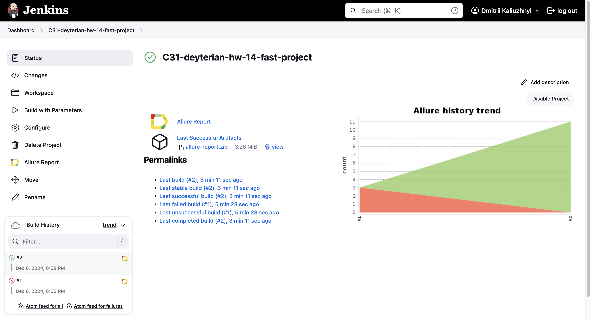
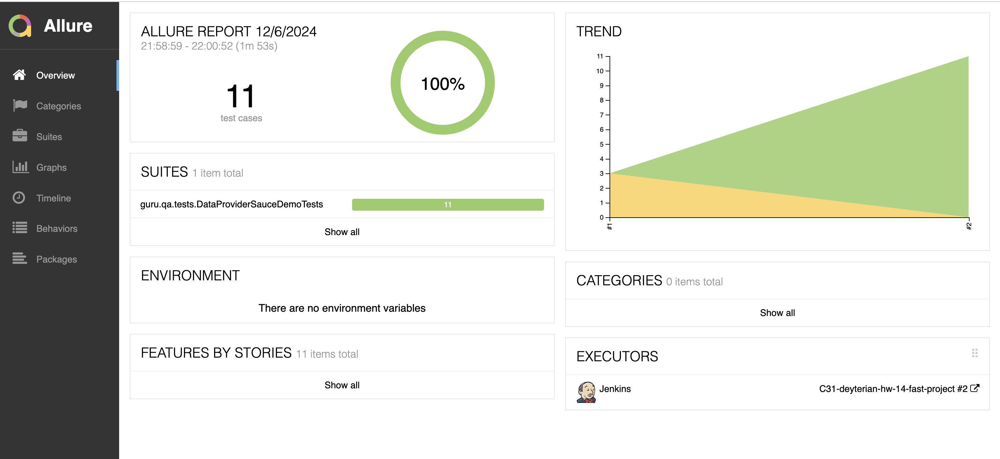
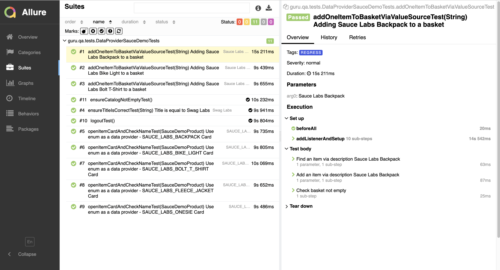
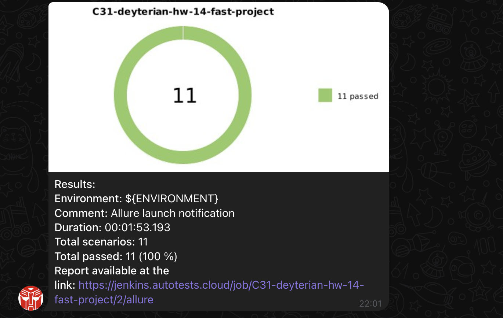
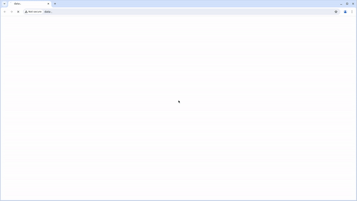

# Проект по автоматизации тестовых сценариев для SauceDemo
## **Содержание:**
* <a href="#tools">Использованный стек технологий</a> 
* <a href="#launchAutotest">Запуск автотестов</a>
* <a href="#jenkinsBuild">Сборка в Jenkins</a>
* <a href="#allureReport">Пример Allure-отчета</a>
* <a href="#telegramNotification">Уведомления в Telegram с использованием бота</a>
* <a href="#testExampleGif">Видео примера запуска тестов в Selenoid</a>

<a id="tools"></a>
## Использованный стек технологий

<p align="center">


</p>

- В данном проекте автотесты написаны на языке <code>Java</code> с использованием фреймворка для тестирования Selenide.
- В качестве сборщика был использован - <code>Gradle</code>.
- Использованы фреймворки <code>JUnit 5</code> и [Selenide](https://selenide.org/).
- При прогоне тестов браузер запускается в [Selenoid](https://aerokube.com/selenoid/).
- Для удаленного запуска реализована джоба в <code>Jenkins</code> с формированием Allure-отчета и отправкой результатов в <code>Telegram</code> при помощи бота.

Содержание Allure-отчета:
* Шаги теста;
* Скриншот страницы на последнем шаге;
* Page Source;
* Логи браузерной консоли;
* Видео выполнения автотеста.

<a id="launchAutotest"></a>
## Запуск автотестов

### Запуск тестов из терминала
```
gradle clean test
```
При выполнении команды, данные тесты запустятся удаленно в <code>Selenoid</code>.

### Запуск тестов на удаленном браузере
```
gradle clean test -Denv=main
```
При необходимости также можно переопределить параметры запуска

```
clean
${TASK}
-DremoteHost=https://${REMOTE_LOGIN}:${REMOTE_PASSWORD}@${REMOTE_URL}/wd/hub
-Dbrowser=${BROWSER}
-DbrowserVersion=${BROWSER_VERSION}
-DbrowserSize=${BROWSER_SIZE}
```

### Параметры сборки
* <code>TASK</code> – Команда запуска тестов. По-умолчанию - <code>smoke_test</code>.
* <code>BROWSER</code> – браузер, в котором будут выполняться тесты. По-умолчанию - <code>chrome</code>.
* <code>BROWSER_VERSION</code> – версия браузера, в которой будут выполняться тесты. По-умолчанию - <code>125</code>.
* <code>BROWSER_SIZE</code> – размер окна браузера, в котором будут выполняться тесты. По-умолчанию - <code>1920x1080</code>.
* <code>REMOTE_URL</code> – адрес удаленного сервера, на котором будут запускаться тесты.


##  Сборка в Jenkins
<p align="center">

</p>

##  Пример Allure-отчета
### Overview

<p align="center">

</p>

### Результат выполнения теста

<p align="center">

</p>

##  Уведомления в Telegram с использованием бота

После завершения сборки, бот созданный в <code>Telegram</code>, автоматически обрабатывает и отправляет сообщение с результатом.

<p align="center">

</p>

## Видео примера запуска тестов в Selenoid
<a id="testExampleGif"></a>
К каждому тесту в отчете прилагается видео прогона.
<p align="center">
  
</p>